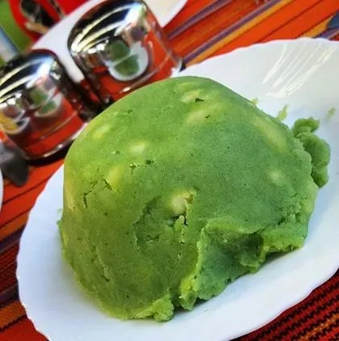
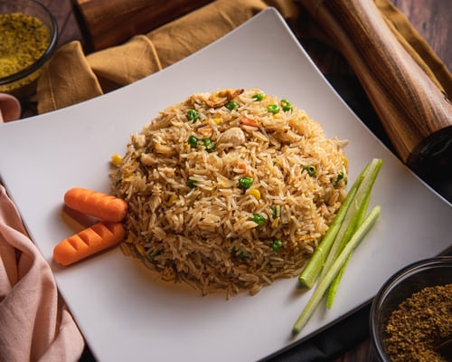
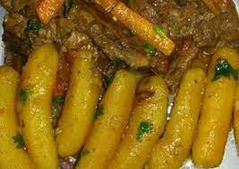

# odin-recipes
This is part of Odin Project Learning.

In this project, i will be using Hyper Text Markup language(HTML) to build three types of Kenyan food recipes, namely:
1. Mukimo

3. Rice

5. Matoke/Plantain

The skills demonstrated here is basic HTML syntax for links(ordered and unordered lists), tags, images, among other elements.

